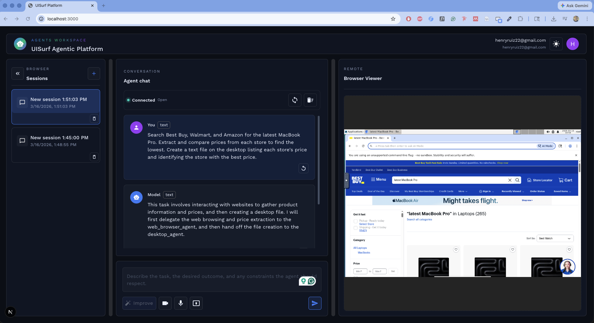

# UISurf Agentic Platform

**UISurf Agentic Platform** is a multi-repository platform for building and operating **Universal UI Agents** capable of controlling both **web browsers and desktop environments** to automate complex tasks.

The platform enables users to describe tasks in **natural language** that require navigating web interfaces or interacting with a computer. UISurf then manages the **end-to-end execution** of the workflow by reasoning about the request, interacting with user interfaces, gathering relevant information, and performing the required actions automatically.

UISurf leverages the **multimodal capabilities of Gemini** to reason over UI screenshots and the current visual state of the browser or desktop. This allows agents to interpret the environment and determine the next best action during an automation workflow.

This project was created to participate in the **[Gemini Live Agent Challenge](https://geminiliveagentchallenge.devpost.com/)**, a Devpost hackathon focused on building next-generation multimodal and agentic experiences.

---

## Example Task

> Go to Best Buy, Walmart, and Amazon, find which store has the best price for the latest MacBook Pro, and create a text file on the desktop with the results of the comparison.

In this workflow, UISurf launches an **isolated automation session**, navigates multiple retailer websites, compares product prices, and then switches from browser interaction to desktop interaction to save the results locally.

This example demonstrates how UISurf agents can **combine browser automation with desktop interaction** to complete multi-step workflows autonomously.

---

## Project Overview

UISurf is an Agentic UI Automation Platform with three main responsibilities:

- run Universal UI Agents that can use browsers and desktops as tools
- orchestrate isolated remote automation sessions for those agents
- provide an authenticated operator workspace where users can launch and monitor tasks

The platform is organized as three primary repositories and services:

- `uisurf-agent`
- `uisurf-admin`
- `uisurf-app`

Together, these components form the execution layer, control plane, and user-facing application for UI automation.

## Local Project Structure

```text
uisurf-agentic-platform/
  README.md
  uisurf-agent/
    src/
    docker/
    scripts/
    README.md
    pyproject.toml
  uisurf-admin/
    src/
    scripts/
    README.md
    pyproject.toml
  uisurf-app/
    src/
    ui/
    scripts/
    README.md
    pyproject.toml
```

## Platform Architecture

UISurf is structured around three layers:

1. Agent runtime layer
2. Session orchestration layer
3. User application layer

At runtime, the platform works like this:

1. A user signs in to the UISurf application and submits a task.
2. The application determines whether a managed UI automation session is required.
3. The admin service provisions or restores an isolated agent session.
4. The agent runtime executes browser or desktop actions inside that environment.
5. The application streams session state back to the user so the task can be observed and guided.

## Google Cloud Architecture

Below is an overview of the current architecture and the Google Cloud Platform services used in UISurf.


### `uisurf-app`

`uisurf-app` is deployed on Google Cloud Run and serves as the main entry point for users interacting with the platform.

The application uses:

- Firebase Authentication for user authentication and platform access management
- Firestore to store and manage session metadata and chat session information

The application consists of:

- a Next.js frontend that provides the user interface
- a FastAPI backend that handles API requests and coordinates agent interactions

For the multi-agent system, the platform uses Google ADK (Agent Development Kit).
ADK agents connect to automation agents running inside session-level containers via the Agent2Agent (A2A) protocol.

Additionally, Vertex AI is used for agent session management and orchestration.

### `uisurf-admin`

`uisurf-admin` is a FastAPI service responsible for managing the lifecycle of UI automation agent sessions.

This service runs on a Google Compute Engine virtual machine and interfaces with a local Docker daemon through the Docker Python API.

Its responsibilities include:

- spinning up sandboxed `uisurf-agent` containers on demand
- managing container lifecycle for each session
- listing active sessions
- restoring sessions after service restarts
- deleting sessions when they are no longer needed

Each automation session runs in its own isolated Docker container, which provides safe and independent execution.

### `uisurf-agent`

`uisurf-agent` runs inside a sandboxed Docker container and provides the runtime environment for UI automation agents.

Each container exposes two A2A-compatible agents:

- Browser Agent, which controls web browsers via Playwright
- Desktop Agent, which controls the operating system desktop

These agents allow higher-level orchestration agents to execute UI automation tasks in a secure and isolated environment.

## Core Components

### `uisurf-agent`

`uisurf-agent` is a Python package that provides the core runtime for UI automation agents.

These agents can operate in two environments:

- Web Browser Automation using Playwright
- Desktop Automation using desktop control utilities that interact with operating system interfaces

The package implements Universal UI Agents using an agentic reasoning loop. In practice, that means an agent can:

- observe the current UI state
- decide what action should happen next
- execute interactions against a browser or desktop
- continue iterating until the task is complete

This makes the agent suitable for tasks that require multiple steps, adaptation to changing UI state, and coordination across different interfaces.

#### Capabilities

`uisurf-agent` includes support for:

- browser automation agents
- desktop automation agents
- local CLI-based execution for manual testing and development
- A2A-compatible agent exposure for browser and desktop agents

The A2A support allows external agents or orchestration systems to invoke UISurf agents as tools in a distributed agent ecosystem.

#### Sandboxed Container Runtime

The package can also be wrapped and deployed as a Docker container that provides a sandboxed computer-use environment.

That container can include:

- a UI operator service responsible for executing UI automation commands
- a sandboxed computer-use agent capable of controlling browser and desktop interfaces
- optional VNC or noVNC access for observing the session remotely

This model enables secure and isolated execution of automation tasks without requiring direct access to the host environment.

#### Role In The Platform

`uisurf-agent` is the execution engine of UISurf. It is responsible for doing the actual UI work once a session is provisioned.

### `uisurf-admin`

`uisurf-admin` is the backend session management service responsible for orchestrating UISurf agent sessions.

It acts as the control plane of the platform.

#### Responsibilities

The service is responsible for:

- creating UISurf agent session containers on demand
- spinning up and managing Docker-based VNC sandbox environments
- listing active sessions managed by the platform
- restoring managed sessions from Docker when the API restarts
- deleting sessions when they are no longer needed

It also exposes authenticated administrative endpoints for:

- user management
- session lifecycle management

#### Why It Exists

UISurf needs a reliable service that can treat UI automation environments as managed infrastructure instead of ad hoc local processes.

`uisurf-admin` provides that orchestration layer by:

- tracking managed session containers
- reconstructing session state from Docker after restarts
- making session management available through authenticated APIs

This lets the rest of the platform request automation environments on demand and interact with them consistently.

### `uisurf-app`

`uisurf-app` is the main user-facing application.

It is a full-stack operator workspace that allows authenticated users to interact with automation sessions through a chat-based interface.

The application combines:

- a FastAPI backend
- a Next.js frontend
- Firebase Authentication for end-to-end authentication



#### User-Facing Capabilities

Through the UISurf application, users can:

- create and manage UI automation sessions
- interact with agents using natural language
- refine prompts before or during execution
- observe running automation tasks
- control remote UI sessions

This is the layer where users describe desired outcomes and where operators observe execution, inspect results, and manage ongoing work.

#### Role In The Platform

`uisurf-app` is the main operator experience. It connects end users to the underlying session and agent infrastructure and presents those capabilities through a secure web interface.

## How The Components Interact

The three services are designed to work together as a coordinated system.

### Interaction Flow

1. A user authenticates in `uisurf-app`.
2. The user starts a chat or submits a natural-language automation request.
3. `uisurf-app` requests a managed session when remote execution is needed.
4. `uisurf-admin` creates or restores a Docker-backed UISurf agent session.
5. The provisioned environment runs `uisurf-agent`.
6. `uisurf-agent` controls the browser, desktop, or both to execute the task.
7. Session state, remote access details, and automation progress are exposed back through `uisurf-app`.

### Conceptual Architecture

```text
User
  |
  v
uisurf-app
  |  Cloud Run, Firebase Auth, Firestore, ADK coordination
  v
uisurf-admin
  |  GCE VM, Docker session orchestration and lifecycle management
  v
uisurf-agent
  |  browser automation / desktop automation / A2A agent runtime
  v
Sandboxed browser and desktop environment
```

## Session Workflow

The session lifecycle currently works as follows:

1. A user starts a new chat session from the UISurf application.
2. The system creates a Vertex AI ADK session for the conversation.
3. The backend sends a request to `uisurf-admin` to create a new automation session.
4. `uisurf-admin` spins up a Docker container running `uisurf-agent`.
5. The container exposes the Browser Agent and Desktop Agent through the A2A protocol.
6. The ADK orchestration agents connect to those agents and begin executing automation tasks.
7. When the user deletes the session, the admin API stops and removes the associated container.

## Example End-To-End Scenario

For the MacBook Pro price-comparison task, the platform can operate like this:

1. The user submits the task from the UISurf web application.
2. A remote session is created for the task.
3. The browser agent opens Best Buy, Walmart, and Sam's Club.
4. The agent navigates product pages, extracts pricing information, and compares the available offers.
5. The task may then switch to desktop control so the agent can create a text file and write the results.
6. The user can observe the session through the application and review the final output.

This demonstrates the core idea of UISurf: a single agent workflow can span multiple UIs and multiple execution modalities while remaining accessible through one platform.

## Technology Stack

The current repository structure shows a platform built primarily on:

- Python 3.11+
- FastAPI
- Docker
- Google Cloud Run
- Google Compute Engine
- Firestore
- Firebase Authentication
- Vertex AI
- Google ADK
- Playwright
- desktop control libraries
- Next.js
- React

Additional package-level details are documented in the component READMEs.

## Future Improvements

For future scalability and performance improvements, the platform is planned to migrate from Docker-based container management on a virtual machine to a Kubernetes-based orchestration system.

Using Kubernetes would allow:

- improved session scalability
- better resource management
- faster container orchestration
- more reliable session lifecycle handling

In that architecture, each UI automation session would run as a Kubernetes-managed sandboxed agent container, replacing the current Docker-based approach.

## Component Documentation

Each component in the platform has its own README with implementation and local-development details:

- [uisurf-agent/README.md](/Users/haruiz/open-source/uisurf-agentic-platform/uisurf-agent/README.md)
- [uisurf-admin/README.md](/Users/haruiz/open-source/uisurf-agentic-platform/uisurf-admin/README.md)
- [uisurf-app/README.md](/Users/haruiz/open-source/uisurf-agentic-platform/uisurf-app/README.md)

## Summary

UISurf Agentic Platform provides the full stack required to run Universal UI Agents safely and usefully in production-like environments:

- `uisurf-agent` runs the automation logic
- `uisurf-admin` manages isolated session infrastructure
- `uisurf-app` gives users a secure interface to launch, observe, and control agentic UI automation

The result is a platform where natural-language tasks can be translated into real browser and desktop actions executed inside managed sandbox environments.
